# Electric Kitchens

Click [here](https://electric-kitchens-02035ecbc37c.herokuapp.com) for the live link.

## Purpose

The purpose of this site is to allow users to purchase electric kitchen appliances. It allows them to easily navigate the site to find what they are looking for and to feel safe about making a purchase. Registered users can save their delivery information, leave reviews on products and add products to their wishlist.

## Table of Contents

### [User Experience](#user-experience-ux)
* [Project Goals](#project-goals)
* [Target Audience](#target-audience)
* [New user](#new-user)
* [Registered user](#registered-user)
* [Admin user](#admin-user)
### [Agile Methodology](#agile-methodology-1)
* [Epics](#epics)
* [User Stories](#user-stories)
### [Design](#design-1)
* [Color Scheme](#color-scheme)
* [Typography](#typography)
* [Wireframes](#wireframes)
* [Database Scheme](#database-scheme)
### [Features](#features-1)
* [Security Features](#security-features)
* [Existing Features](#existing-features)
* [Future Features](#future-features)
### [Technologies Used](#technologies-used-1)
* [Languages Used](#languages-used)
* [Databases Used](#databases-used)
* [Frameworks Used](#frameworks-used)
* [Programs Used](#programs-used)
### [Testing](#testing-1)
### [Deployment and Local developement](#deployment-and-local-development)
* [Heroku Deployment](#heroku-deployment)
* [Local Developement](#local-development)
* [ElephantSQL Database](#elephantsql-database)
### [References](#references-1)
* [Credits](#credits)
* [Acknowledgments](#acknowledgments)

## User Experience (UX)

### Project Goals

To allow users to:
* View the products available for purchase.
* View the details of a product.
* See their total purchase price at any time in the navbar.
* Register for an account.
* Log in to their personal account.
* Log out of their account.
* Recover their password if they forget their password.
* Receive an email confirmation when they register for an account.
* View their profile page when logged in.
* Save their delivery information.
* View their delivery information on their profile page.
* View their order history on their profile page.
* Sort products by category.
* Sort products by price, rating, wattage, ease of use or capacity.
* Search for products in the search bar.
* Select a quantity of an individual product to purchase.
* Add a product to their shopping bag.
* View their shopping bag at any time.
* Update the quantity of an item in their shopping bag.
* Remove a product from their shopping bag.
* Enter their payment information.
* Feel safe and secure when entering their payment information.
* View a confirmation of their order.
* Receive a confirmation email for each order submitted.
* Review a product.
* View the reviews they have made.
* Remove a review that they made.
* Add a product to their personal wishlist.
* View their wishlist.
* Remove a product from their wishlist.

### Target Audience
The website's target audience are customers who wish to purchase electrical kitchen appliances. It is user friendly allowing users to browse the website easily. Users can search for products in the search bar using keywords or they can browse the available categories using the links in the navbar. They can sort the products by price, rating, capacity, etc. They can register an account on the website allowing them to keep a record of their order history and save their delivery information. 

Each user has the ability to:

### New User
* View the products available for purchase.
* View the details of a product.
* See their total purchase price at any time in the navbar.
* Sort products by category.
* Sort products by price, rating, wattage, ease of use or capacity.
* Search for products in the search bar.
* Select a quantity of an individual product to purchase.
* Add a product to their shopping bag.
* View their shopping bag at any time.
* Update the quantity of an item in their shopping bag.
* Remove a product from their shopping bag.
* Enter their payment information.
* Feel safe and secure when entering their payment information.
* View a confirmation of their order.
* Receive a confirmation email for each order submitted.
* Register for an account.

### Registered User
* Log in to their personal account.
* Log out of their account.
* Recover their password if they forget their password.
* Receive an email confirmation when they register for an account.
* View their profile page when logged in.
* Save their delivery information.
* View their delivery information on their profile page.
* View their order history on their profile page.
* Review a product.
* View the reviews they have made.
* Remove a review that they made.
* Add a product to their personal wishlist.
* View their wishlist.
* Remove a product from their wishlist.

### Admin User
* Add a product to the website.
* Edit/Update a product's details.
* Delete a product from the website.

[Back to Top](#electric-kitchens)

## Agile Methodology
* Agile Methodology was used for this project as it required a lot of planning.
* The Kanban Board was created using GitHub. The link to the board is [here](https://github.com/users/Soro82/projects/3).
* I used six milestones for the project, one for each Epic. 
* The milestones helped to track my progress through the project. 
* The User Stories were divided into three categories - must have, should have and could have. 
* I used labels to categorize the user stories.
* I changed the "Approve Reviews" user story from "should have" to "won't have" as it was not required to complete the project.

### Epics

* Viewing and Navigation
* Registration and User Accounts
* Sorting and Searching
* Purchasing and Checkout
* Admin and Store Management
* Reviews and Wishlist

### User Stories

#### Epic: Viewing and Navigation

* View Products
* View Product Details
* Identify Deals
* View my Total

#### Epic: Registration and User Accounts

* Register an Account
* Login/Logout
* Recover Password
* Email Confirmation
* User Profile

#### Epic: Sorting and Searching

* Sort Products
* Sort by Category
* Sort Multiple Categories
* Search for Products
* View Search Results

#### Epic: Purchasing and Checkout

* Select Quantity
* View Bag
* Adjust Bag
* Enter Payment Information
* Feel Safe and Secure
* View Order Confirmation
* Receive Email Confirmation

#### Epic: Admin and Store Management

* Add a Product
* Edit/Update a Product
* Delete a Product
* Approve Reviews

#### Epic: Reviews and Wishlist

* Review a Product
* Remove Reviews
* Add to Wishlist
* View Wishlist
* Update Wishlist

[Back to Top](#electric-kitchens)

## Design

### Color Scheme

### Wireframes

Home Page

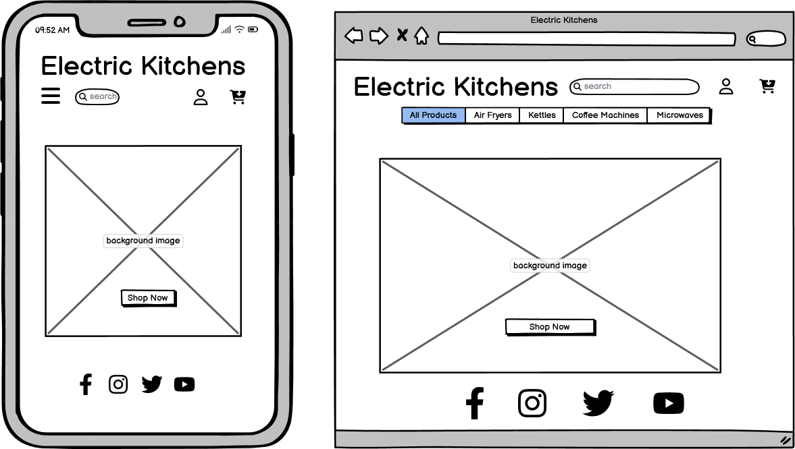

All Products Page

Product Details Page

Shopping Bag Page

Checkout Page

My Profile Page

My Reviews Page

My Wishlist Page

### Database Scheme

* [Draw.io](https://draw.io) was used to create the database scheme.

[Back to Top](#electric-kitchens)

## Features

### Security Features

#### User Authentication
* Django comes with a user authentication system called AllAuth. 
* It handles user accounts, groups, permissions and cookie-based user sessions.
* The Django authentication system handles both authentication and authorization. 
* Authentication verifies a user is who they claim to be, for example when a user is logging in to the website. 
* Authorization determines what an authenticated user is allowed to do, for example in the navbar in base.html we check if the user is logged in using this line of code: .

#### CSRF (Cross Site Request Forgery)
* CSRF attacks allow a malicious user to execute actions using the credentials of another user without that user’s knowledge or consent.
* Django has built-in protection against most types of CSRF attacks.
* CSRF protection works by checking for a secret in each POST request. 
* This ensures that a malicious user cannot “replay” a form POST to your website and have another logged in user unwittingly submit that form. 
* The malicious user would have to know the secret, which is user specific (using a cookie).

#### The login_required Decorator
* The login_required decorator is on all views that require the user to be logged in.
* For this website it was used on the views in the products, profiles, reviews and wishlist apps. It ensures that only authenticated users can access these views.

#### Custom Error Pages
* The 404 and 500 Error Pages are used to allow the user to return to the website’s home page.
* They use the base.html to inform the user of their error in a friendly and helpful manner.

#### Form Validation
* The Date of Purchase on the review form is validated to ensure the date entered is today's date or a previous date.
* All compulsory fields on all forms must be complete before the form can be submitted.

[Back to Top](#electric-kitchens)

### Existing Features

#### Home Page

* The Home page has a background image of a mixture of different electric kitchen appliances.
* There is a Shop Now button which opens the All Products page.

#### Navbar

* The Navbar contains the website title which is also a link to the home page.
* There is a Search Bar to allow the user to search for particular products or keywords.
* The All Products dropdown menu has a link to the All Products page and links to allow the user to view the All Products page arranged by price, rating, wattage and ease of use.
There are links to view only all the kettles, washing machines, air fryers and coffee machines.
* There is a shopping cart icon which is a link to the Shopping Bag page.
* There is a person icon which opens the My Account dropdown menu.
* There is a banner informing customers of free delivery on all purhcases over $50.

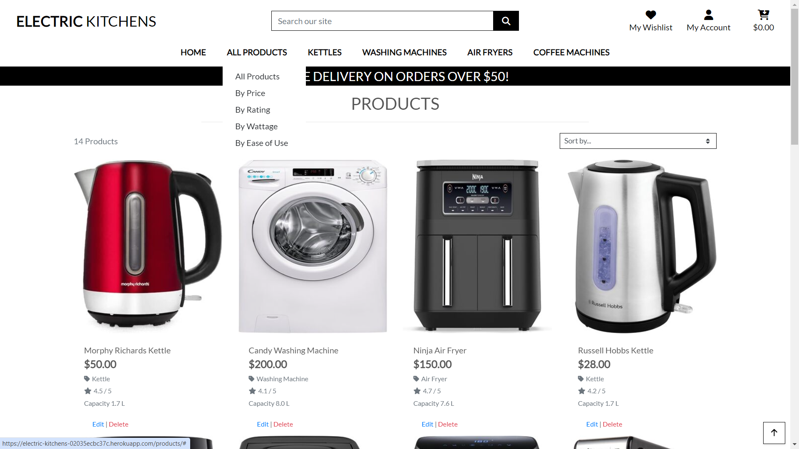

##### Navbar(Logged Out)

* The My Account dropdown menu contains links to the login and register pages when the user is logged out.

##### Navbar(Logged In)

* The My Account dropdown menu contains links to the My Profile, My Reviews and Logout pages when the user is logged in.
* There is a link to My Wishlist beside the My Account dropdown menu when the user is logged in.

##### Navbar(Admin Logged In)

* There is an extra link in the My Account dropdown menu called Product Management when admin users are logged in.

#### All Products Page

* All the products on the website are listed on the All Products page with the total number of products at the top left.
* There is a dropdown menu allowing the user to sort the products by price, rating, wattage, ease of use or capacity.
* Each product's image is displayed with the product's name, price, category, rating and capacity underneath.
* The user can click on the product's image to open the Product Detail page to view more details about the product.

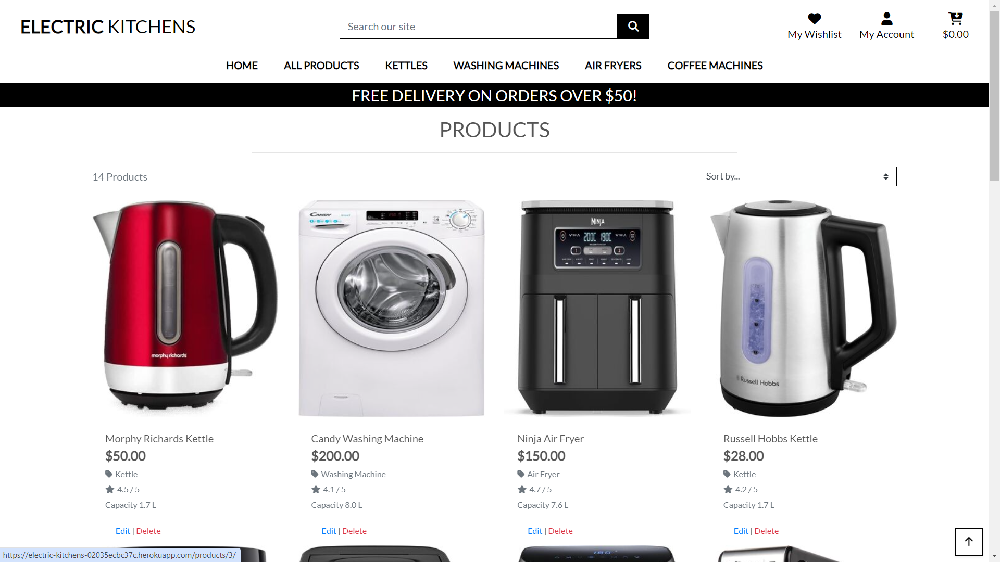

#### Product Details Page(Logged Out)

* There is a large image of the product and all the details of the product on this page.
* The quantity box allows the user to choose the quantity of the product they wish to purchase.
* There is a plus and minus button on either side of the quantity box.
* The minus button is disabled when the quantity is on 1.
* The plus button is disabled when the quantity is 99.
* The Keep Shopping button allows the user to return to the All Products page.
* The Add to Bag button allows the user to add the product to their shopping bag.

#### Product Details Page(Logged In)

* When the user is logged in, there are 2 more buttons under the Add to Bag button.
* The Add to Wishlist button adds the product to the user's wishlist.
* The Add Review button opens the Add Review page allowing the user to add a review for that product.

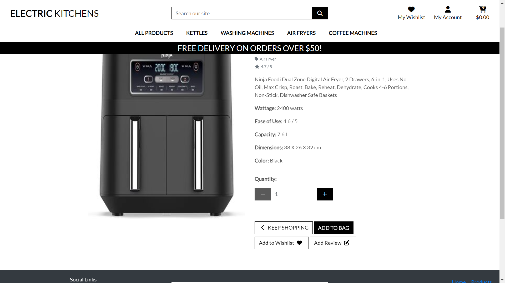

#### Product Details Page(Admin Logged In)

* When admin users are logged in, there are 2 extra buttons above the quantity box.
* The Edit button opens the Edit Product page.
* The Delete button will delete the product and all it's details from the website.

#### Shopping Bag Page

* The Shopping Bag Page lists the all the products the user has added to their shopping bag.
* The page shows the image, product name, product price, quantity added and the subtotal for each product in the bag.
* There are two button under the quantity box for each item in the bag.
* The Update button allows the user to change the quantity for that item.
* When they click on the Update button the subtotal will also change.
* The Remove button allows the user to remove that item from their shopping bag.
* The bag total, delivery cost and grand total are displayed at the bottom of the page.
* The Keep Shopping button allows the user to return to the All Products page.
* The Secure Checkout button opens the Checkout page.

#### Checkout Page

* The Checkout page contains input fields for the user to enter their details.
* Each field has a placeholder telling the user what details need to be entered into that field.
* All compulsory fields have an asterix beside the placeholder name.
* The Details section asks for the user's full name and email address.
* The delivery information is where the user wants their products delivered to.
* There is a checkbox under the delivery information allowing the user to save their delivery information to their profile.
* The fields will be populated using this information the next time they make a purchase.
* The payment details field is made safe and secure using Stripe.
* The Adjust Bag button allows the user to return to their shopping bag.
* The Complete Order button takes the payment from the user and creates the order.
* The Order Summary is listed on the right to remind the user of what they are purchasing.

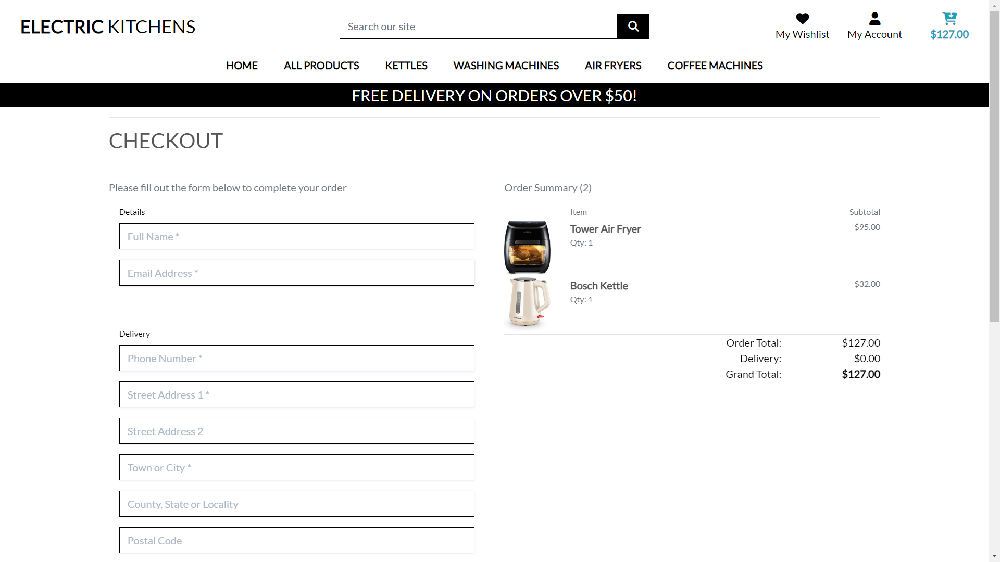

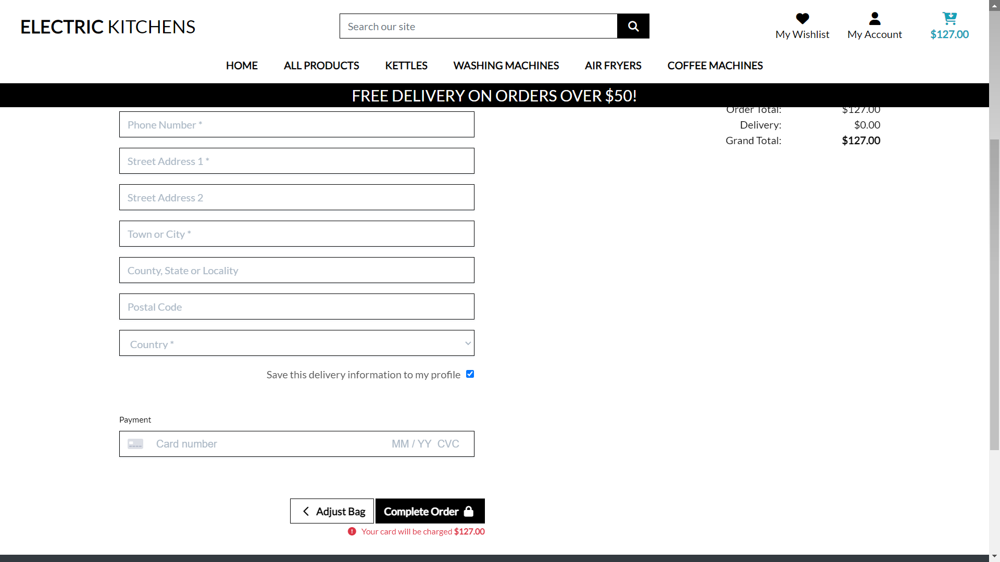

#### The Loading Spinner

* A loading spinner is displayed when the user clicks on the Complete Order button on the Checkout page.

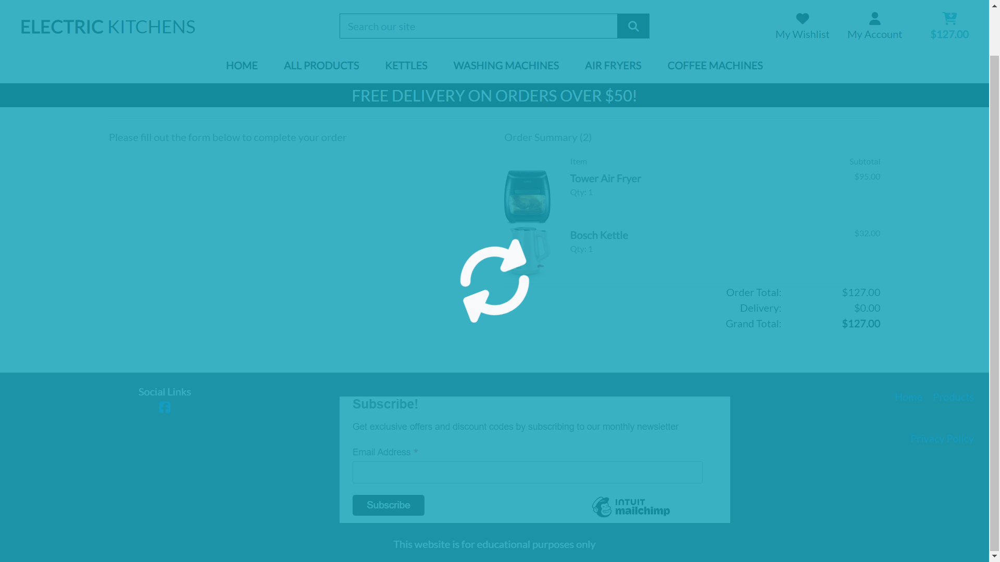

#### Order Confirmation Page

* The Order Confirmation Page opens when the order is completed.
* This shows the order details, the address the products will be delivered to and the total cost.
* A copy of the Order Confirmation is emailed to the user's email address.
* The user will also see a success message displayed informing them of this.

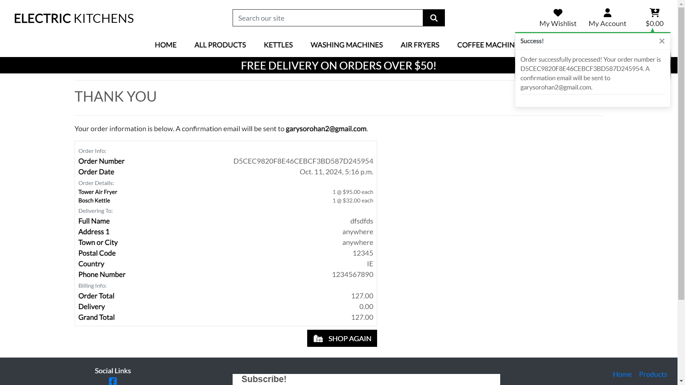

#### My Profile Page

* The My Profile page contains input fields for the user to enter their delivery information.
* Each field has a placeholder telling the user what details need to be entered into that field.
* The delivery information is where the user wants their products delivered to.
* The user can update their delivery information at any time and click on the Update Information button.
* All of the user's previous orders are shown on the right of the page under Order History.
* The user can click on the order number to view the order confirmation for that order.

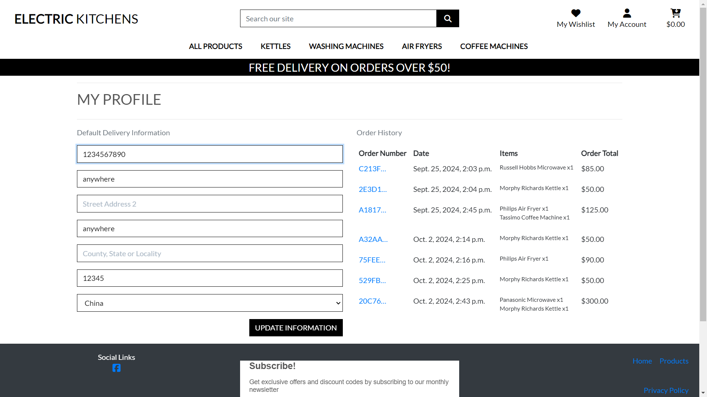

#### Add Review Page

* The product image and product description are displayed at the top of the page.
* There is a large textbox allowing the user the enter the details of their review.
* Underneath are three dropdowm menu boxes allowing the user to choose from five options.
* The user can choose from 1 to 5 on how they rate the product, how easy it is to use and the energy rating of the product.
* The Date of Purchase box is optional. There is also validation on it to ensure the user chooses a previous date.
* The Cancel button will return the user to the All Products page.
* The Add Review button will add the review to the user's profile.

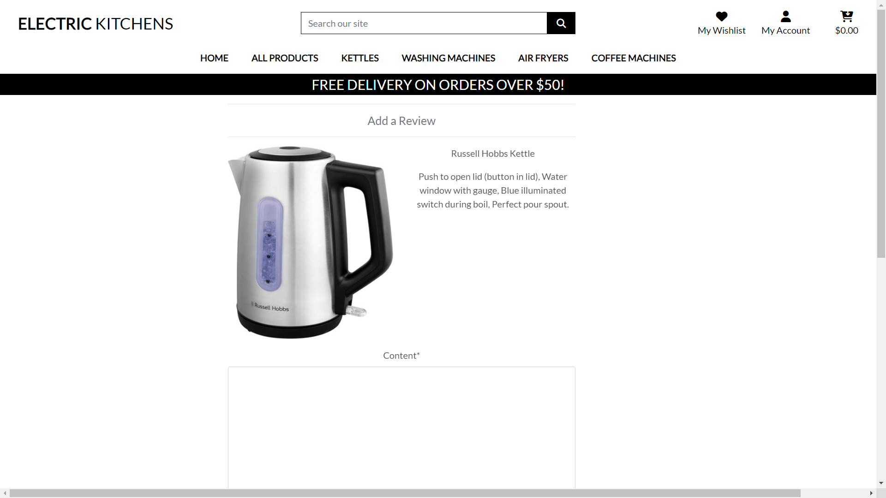

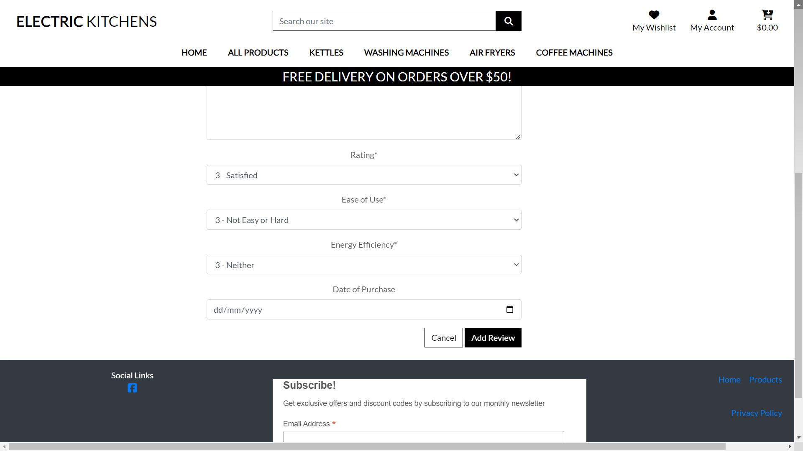

#### My Reviews Page

* The My Reviews page contains four columns for each review.
* The product's name and image.
* The user's review and the purchase date if applicable.
* The options the user chose for the product's rating, ease of use and energy efficency.
* A Remove button allowing the user to review this review.
* At the bottom of the page there is a button allowing the user to return to the All Products page.

#### My Wishlist Page

* The My Wishlist page contains four columns for each product in the wishlist.
* The product's name, image, price and a Remove button allowing the user to remove the product from their wishlist.
* At the bottom of the page there is a button allowing the user to return to the All Products page.

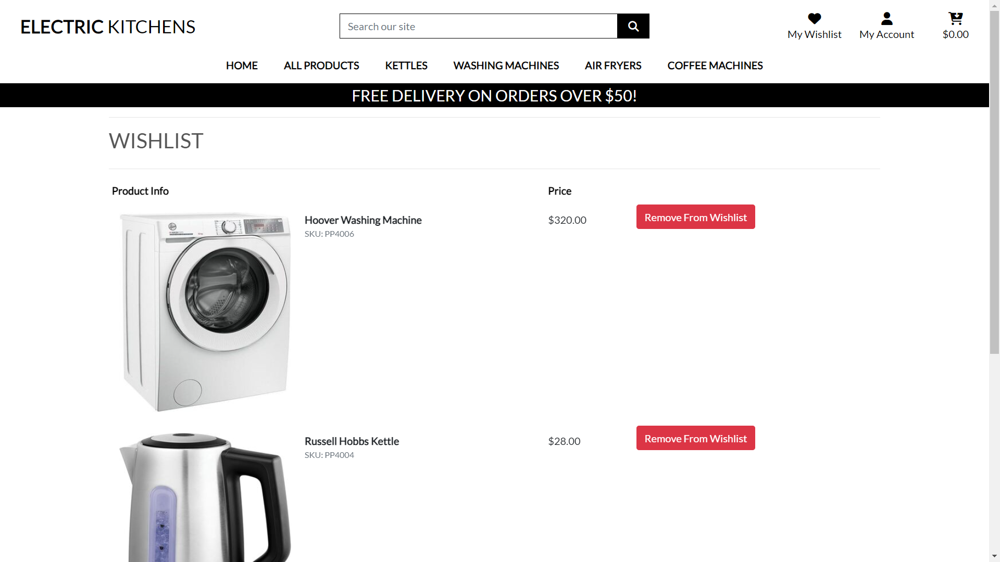

#### Product Management Page

* When the admin user clicks on Product Management in the My Account dropdown menu it opens the Product Management Page.
* The Product Management Page contains a form allowing the admin user to add products to the website.
* The form contains a dropdown menu containing all the product categories.
* All compulsory fields have an asterix beside the fields label name.
* There is a button under the "Image Url" field allowing the user to upload an image for the product.
* The Cancel button will return the user to the All Products page.
* The Add Product button will add the product to the website.

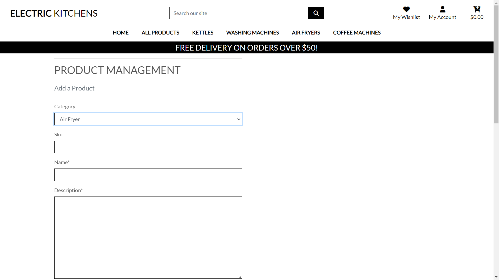

#### Edit Product Page

* The Edit Product Page has a form is the same as the Add Product form.
* All the fields are populated with the details of the product.
* There is an alert message displayed informing the user that they are editing a product.
* The user can change any of the field values and click on the Update Product button.
* This will update the details of the product in the database.
* The Cancel button will return the user to the All Products page.

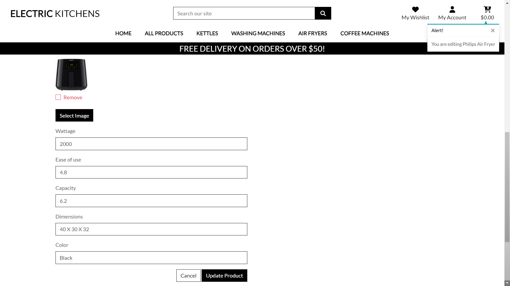

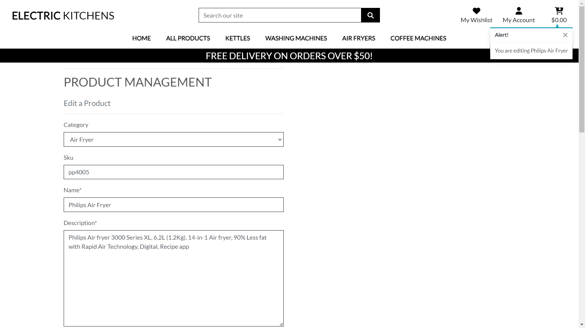

#### Signup, Login and Logout Pages

* The Signup Page contains a link to the "Login Page" to allow users who are already signed up to log in.
* The Login Page contains a link to the "Signup Page" to allow unregistered users to register an account.

    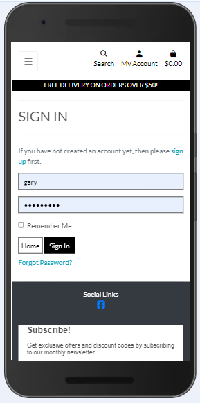     

#### Footer

* The footer contains a link to the website's Facebook page.
* There is a form allowing users to signup to the newsletter by entering their email address.
* There is a link to the website's Privacy Policy.
* There are also links to the Home page and the All Products page.

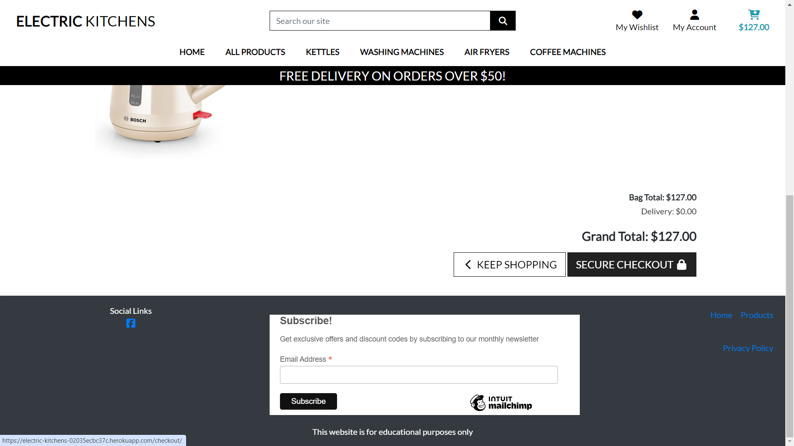

### Future Features
* Reviews must be approved by admin users before they are shown.
* Reviews can be seen by all users.
* A FAQs section.

[Back to Top](#electric-kitchens)

## Technologies Used

### Languages Used
* HTML5
* CSS
* JavaScript
* Python

### Frameworks Used
* Django - https://www.djangoproject.com
* Bootstrap v4.1 - https://getbootstrap.com

### Programs Used
* GitHub - to host the source code.
* GitPod - IDE used to develop the website.
* Heroku - to deploy the project.
* W3C Markup Validation Service - to validate the HTML code.
* W3C CSS Validation Service - to validate the CSS code.
* JSHint - to validate the JavaScript code.
* CI Pep8 Python Validator - to validate the Python code.
* Am I Responsive - to test the website's responsiveness.

[Back to Top](#electric-kitchens)

## Testing

Click [here](TESTING.md) to open the Testing section.

## Deployment and Local Development

### Heroku Deployment

The website was deployed using [Heroku](https://www.heroku.com/) through the following steps.

1. Log in to Heroku or create an account if necessary.
2. Click on the button labeled "New" from the dashboard in the top right corner and select the "Create new app" option in the drop-down menu.
3. Enter a unique name for the application and select the region you are in.
4. Click on "create app".
5. Navigate to the settings tab and locate the "Config Vars" section and click "Reveal config vars".
6. To add a config var:
   * In the "KEY" field - enter the KEY name in all capital letters.
   * In the "VALUE" field - enter the actual key and click "Add".
8. Scroll to the "Buildpacks" section and click "Add buildpack".
9. Select Python and save changes.
12. Navigate to the "Deploy" section by clicking the "Deploy" tab in the top navbar.
13. Select "GitHub" as the deployment method and click "Connect to GitHub".
14. Search for the GitHub repository name in the search bar.
15. Click on "connect" to link the repository to Heroku.
16. Scroll down and click on "Deploy Branch".
17. Once the app is deployed, Heroku will notify you and provide a button to view the app.

Click [here](https://electric-kitchens-02035ecbc37c.herokuapp.com) for the live link.

### Local Development

#### Forking

Forking is a way to make a copy of the original repository on your GitHub account to view and change without affecting the original repository.

* Log in to GitHub and locate your GitHub Repository.
* At the top of the Repository(under the main navigation) locate the "Fork" button.
* Now you should have a copy of the original repository in your GitHub account.

#### Cloning

* Log in to GitHub and locate the GitHub Repository.
* Under the repository name click "Clone or download".
* Click on the code button, select clone with HTTPS, SSH or GitHub CLI and copy the link shown.
* Open Git Bash.
* Change the current working directory to the location where you want the cloned directory to be made.
* Type git clone and then paste The URL copied in step 3.
* Press Enter and your local clone will be created.