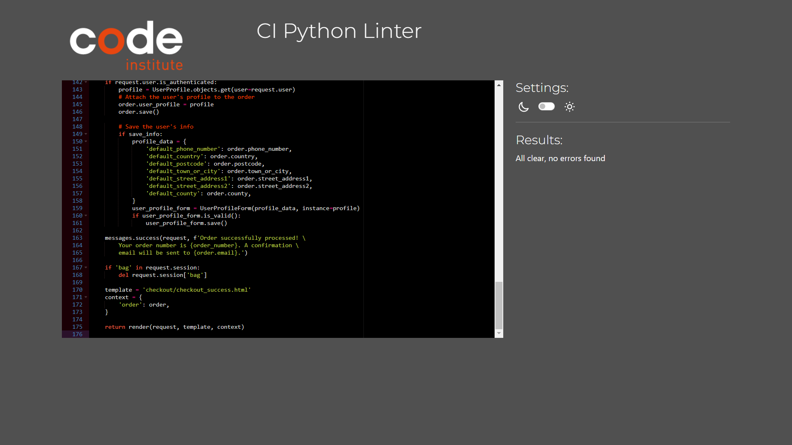

## Testing

Click [here](README.md) to return to the readme file.

## Table of Contents

### [Code Validation](#code-validation-1)
### [Lighthouse Testing](#lighthouse-testing-1)
### [Manual Testing](#manual-testing-1)
### [Bugs](#bugs-1)
### [Responsiveness](#responsiveness-1)

### Code Validation

#### HTML Validation

Home Page

All Products Page

Product Detail Page

Checkout Page

Shopping Bag Page

My Profile Page

My Reviews Page

My Wishlist Page

Login Page

Logout Page

Register an Account Page

Product Management Page

#### Python Validation

| App Name | views.py | urls.py | models.py | forms.py | admin.py |
| :------: | :------: | :-----: | :-------: | :------: | :------: |
| Checkout |  |  |  |  |  |
| Products |  |  |  |  |  |
| Profiles |  |  |  |  | N/A |
| Reviews |  |  |  |  |  |
| Wishlist |  |  |  | N/A |  |
| Bag |  |  | N/A | N/A | N/A |
| Electric Kitchens |  |  | settings.py  | N/A | N/A |

Checkout signals.py

Checkout webhook_handler.py

Checkout webhooks.py

#### CSS Validation

base.css

profile.css

checkout.css

#### JavaScript Validation

stripe_elements.js

### Lighthouse Testing

Home Page

All Products Page

Product Detail Page

Login Page

Register an Account Page

My Profile Page

My Reviews Page

My Wishlist Page

Shopping Bag Page

Checkout Page

Order Confirmation Page

Add Review Page

[Back to Top](#testing)

### Manual Testing

| Location | Test | Expected Result | Result |
| :------: | :--: | :-------------: | :----: |
| Navbar | Click on My Account | Opens the dropdown menu | Pass |
| Navbar/My Account | Click on Login | Opens the login page | Pass |
|  | Click on Register | Opens the signup page | Pass |
|  | Click on Logout | Opens the logout page | Pass |
|  | User Logged In | My Reviews link in My Account | Pass |
|  | Admin User Logged In | Product Management link in My Account | Pass |
| Navbar | User Logged In | My Wishlist link beside My Account link | Pass |
|  | Click on Shopping Bag | Opens the shopping bag page | Pass |
|  | Click on Heading in navbar | Opens the home page | Pass |
|  | Use Search bar to search for "kettle" | Show all Kettles | Pass |
|  | Use Search bar to search for "filter" | Show all products with filters | Pass |
|  | Click on Kettles | Opens the Kettles page | Pass |
|  | Click on Washing Machines | Opens the Washing Machines page | Pass |
|  | Click on Air Fryers | Opens the Air Fryers page | Pass |
|  | Click on Coffee Machines | Opens the Coffee Machines page | Pass |
|  | Click on All Products | Opens the All Products dropdown menu | Pass |
| Navbar/All Products | Click on All Products | Opens the All Products page | Pass |
|  | Click on By Price | Shows all products in order of price | Pass |
|  | Click on By Rating | Shows all products in order of rating | Pass |
|  | Click on By Wattage | Shows all products in order of wattage | Pass |
|  | Click on By Ease of Use | Shows all products in order of ease of use | Pass |
| All Products/Sort By | Click on Price(low to high) | Sorts all products in order of price starting with the cheapist | Pass |
|  | Click on Price(high to low) | Sorts all products in order of price starting with the most expensive | Pass |
|  | Click on Rating(low to high) | Sorts all products in order of rating starting with the lowest | Pass |
|  | Click on Rating(high to low) | Sorts all products in order of rating starting with the highest | Pass |
|  | Click on Capacity(low to high) | Sorts all products in order of Capacity starting with the lowest | Pass |
|  | Click on Capacity(high to low) | Sorts all products in order of Capacity starting with the highest | Pass |
|  | Click on Category(A to Z) | Sorts all products in order of Category starting with Air Fryers | Pass |
|  | Click on Category(Z to A) | Sorts all products in order of Category starting with Washing Machines | Pass |
| Login Page | Enter invalid username | Error message displayed | Pass |
|  | Enter invalid password | Error message displayed | Pass |
|  | Click on Sign Up | Opens the signup page | Pass |
|  | No password entered | Please fill in this field | Pass |
|  | No username entered | Please fill in this field | Pass |
|  | Enter valid username and password | Successfully logged in message | Pass |
| 404 Error Page | Enter incorrect URL | 404 Error Page opens | Pass |
|  | Click on Take Me Home | Returns to Home Page | Pass |
| 500 Error Page | Admin raises an exception | 500 Error Page opens | Pass |
|  | Click on Take Me Home | Returns to Home Page | Pass |

[Back to Top](#testing)

### Bugs

#### Fixed Bugs
| Bug | Solution | Result |
| :-: | :------: | :----: |
| User able to double book a horse | Validate if booking exits | Pass |
| User able to double book a time | Validate if booking time exits | Pass |
| Multiple bookings for same time and date | Validate if booking is full | Pass |
| User able to book previous date to today | Validate booking date | Pass |
| Booking time displayed as integer | booking.get_lesson_time_display | Pass |
| Two users unable to book the same time | Check user against request.user | Pass |
| Navbar dropdown causing page scrollbar | Add "me-lg-4" class | Pass |
| My Bookings in order of date but not time | Order by date and time | Pass |
| Insecure Requests error in console | cloudinary.config(secure = True) | Pass |
| Unable to change location in edit booking | add validation check on location | Pass |
| Unable to change experience in edit booking | add validation check on experience | Pass |

#### Unfixed Bugs
* There are no unfixed bugs.

[Back to Top](#testing)

### Responsiveness

#### Home Page

 
#### Navbar

 

#### Popular Horses

 

#### Horses Page

 

#### Make Booking Page

 

#### My Bookings Page

 

#### Delete Booking Page

 

#### Login Page

 

#### Footer

[Back to Top](#testing)