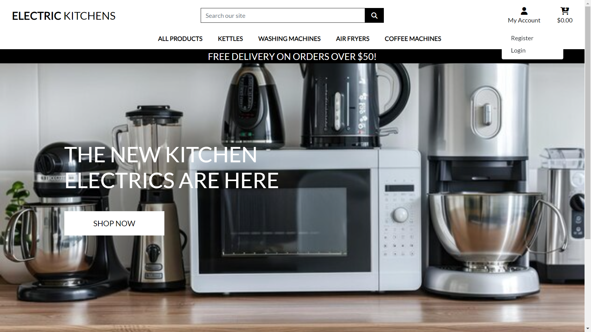

## Testing

Click [here](README.md) to return to the readme file.

## Table of Contents

### [Code Validation](#code-validation-1)
### [Lighthouse Testing](#lighthouse-testing-1)
### [Manual Testing](#manual-testing-1)
### [Bugs](#bugs-1)
### [Responsiveness](#responsiveness-1)

### Code Validation

#### HTML Validation

Home Page

Horses Page

Horses Page Logged In

Login Page

Make Booking Page

My Booking Page

Edit Booking Page

Delete Booking Page

404 Error Page

500 Error Page

#### Python Validation

* book_lesson app

admin.py

forms.py

models.py

urls.py

views.py

* horse_riding_lessons

settings.py

urls.py

#### CSS Validation

style.css

#### JavaScript Validation

script.js

#### WAVE Validation

WAVE Validation

### Lighthouse Testing

Home Page

Horses Page

Sign Up Page

Login Page

Make Booking Page

My Booking Page

Edit Booking Page

Sign Out Page

[Back to Top](#testing)

### Manual Testing

| Location | Test | Expected Result | Result |
| :------: | :--: | :-------------: | :----: |
| Navbar | Click on Login | Opens the login page | Pass |
|  | Click on Sign Up | Opens the signup page | Pass |
|  | Click on Horses | Opens the horses page | Pass |
|  | Click on Logout | Opens the logout page | Pass |
|  | Click on Heading in navbar | Opens the home page | Pass |
|  | User Logged In | Sign Up and Login links change to User's name | Pass |
|  | User Logged Out | User's name link change to Sign Up and Login | Pass |
| Popular Horses | Click on Login | Opens the login page | Pass |
|  | Click on Book Now | Opens the booking page | Pass |
|  | User Logged In | Book Now button displayed | Pass |
|  | User Logged Out | Login button displayed | Pass |
| Horses Page | Click on Login | Opens the login page | Pass |
|  | Click on Next | Display next 3 horses | Pass |
|  | Click on Previous | Display previous 3 horses | Pass |
|  | Click on Book Now | Opens the booking page | Pass |
|  | User Logged In | Book Now button displayed | Pass |
|  | User Logged Out | Login button displayed | Pass |
| Login Page | Enter invalid username | Error message displayed | Pass |
|  | Enter invalid password | Error message displayed | Pass |
|  | Click on Sign Up | Opens the signup page | Pass |
|  | No password entered | Please fill in this field | Pass |
|  | No username entered | Please fill in this field | Pass |
|  | Enter valid username and password | Successfully logged in message | Pass |
| Booking Page |  | Horse name displayed above Lesson Date field | Pass |
|  | No date entered | Please fill in this field | Pass |
|  | Date earlier than today | Correct Error message displayed | Pass |
|  | Date earlier than today | Message fades away after 3 seconds | Pass |
|  | Date and time already booked | Correct Error message displayed | Pass |
|  | Date and time already booked | Message fades away after 3 seconds | Pass |
|  | Two users book same lesson date and time | Booking Confirmed | Pass |
|  | Horse already booked | Correct Error message displayed | Pass |
|  | Horse already booked | Message fades away after 3 seconds | Pass |
|  | Lesson fully booked | Correct Error message displayed | Pass |
|  | Lesson fully booked | Message fades away after 3 seconds | Pass |
|  | Click on Submit | Confirmation Message displayed | Pass |
|  | Click on Submit | Message fades away after 3 seconds | Pass |
|  | Click on Submit | Form fields cleared | Pass |
| My Bookings Page | Click on Edit | Opens the edit booking page | Pass |
|  | Click on Delete | Opens the delete booking page | Pass |
| Edit Booking Page |  | Horse name displayed above Lesson Date field | Pass |
|  | No date entered | Please fill in this field | Pass |
|  | Date earlier than today | Correct Error message displayed | Pass |
|  | Date earlier than today | Message fades away after 3 seconds | Pass |
|  | Date and time already booked | Correct Error message displayed | Pass |
|  | Date and time already booked | Message fades away after 3 seconds | Pass |
|  | Horse already booked | Correct Error message displayed | Pass |
|  | Horse already booked | Message fades away after 3 seconds | Pass |
|  | Lesson fully booked | Correct Error message displayed | Pass |
|  | Lesson fully booked | Message fades away after 3 seconds | Pass |
|  | Click on Update Booking | Confirmation Message displayed | Pass |
|  | Click on Update Booking | Message fades away after 3 seconds | Pass |
|  | Click on Update Booking | Return to bookings page | Pass |
| Delete Booking Page | Click on Confirm Delete | Booking deleted | Pass |
|  | Click on Confirm Delete | Confirmation Message displayed | Pass |
|  | Click on Confirm Delete | Message fades away after 3 seconds | Pass |
|  | Click on Confirm Delete | Return to bookings page | Pass |
| 404 Error Page | Enter incorrect URL | 404 Error Page opens | Pass |
|  | Click on Take Me Home | Returns to Home Page | Pass |
| 500 Error Page | Admin raises an exception | 500 Error Page opens | Pass |
|  | Click on Take Me Home | Returns to Home Page | Pass |

[Back to Top](#testing)

### Bugs

#### Fixed Bugs
| Bug | Solution | Result |
| :-: | :------: | :----: |
| User able to double book a horse | Validate if booking exits | Pass |
| User able to double book a time | Validate if booking time exits | Pass |
| Multiple bookings for same time and date | Validate if booking is full | Pass |
| User able to book previous date to today | Validate booking date | Pass |
| Booking time displayed as integer | booking.get_lesson_time_display | Pass |
| Two users unable to book the same time | Check user against request.user | Pass |
| Navbar dropdown causing page scrollbar | Add "me-lg-4" class | Pass |
| My Bookings in order of date but not time | Order by date and time | Pass |
| Insecure Requests error in console | cloudinary.config(secure = True) | Pass |
| Unable to change location in edit booking | add validation check on location | Pass |
| Unable to change experience in edit booking | add validation check on experience | Pass |

#### Unfixed Bugs
* There are no unfixed bugs.

[Back to Top](#testing)

### Responsiveness

#### Home Page

 
#### Navbar

 

#### Popular Horses

 

#### Horses Page

 

#### Make Booking Page

 

#### My Bookings Page

 

#### Delete Booking Page

 

#### Login Page

 

#### Footer

[Back to Top](#testing)