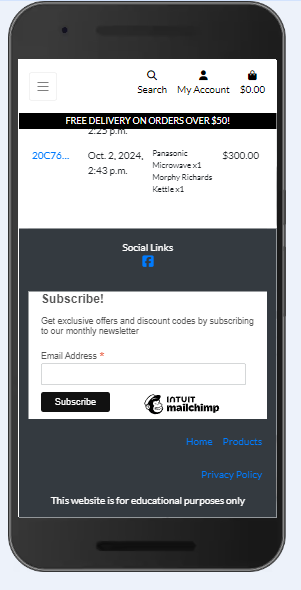

## Testing

Click [here](README.md) to return to the readme file.

## Table of Contents

### [Code Validation](#code-validation-1)
### [Lighthouse Testing](#lighthouse-testing-1)
### [Manual Testing](#manual-testing-1)
### [Bugs](#bugs-1)
### [Responsiveness](#responsiveness-1)

### Code Validation

#### HTML Validation

Home Page

All Products Page

Product Detail Page

Checkout Page

Shopping Bag Page

My Profile Page

My Reviews Page

My Wishlist Page

Login Page

Logout Page

Register an Account Page

Product Management Page

#### Python Validation

| App Name | views.py | urls.py | models.py | forms.py | admin.py |
| :------: | :------: | :-----: | :-------: | :------: | :------: |
| Checkout |  |  |  |  |  |
| Products |  |  |  |  |  |
| Profiles |  |  |  |  | N/A |
| Reviews |  |  |  |  |  |
| Wishlist |  |  |  | N/A |  |
| Bag |  |  | N/A | N/A | N/A |
| Electric Kitchens |  |  | settings.py  | N/A | N/A |

Checkout signals.py

Checkout webhook_handler.py

Checkout webhooks.py

#### CSS Validation

base.css

profile.css

checkout.css

#### JavaScript Validation

stripe_elements.js

### Lighthouse Testing

Home Page

All Products Page

Product Detail Page

Login Page

Register an Account Page

My Profile Page

My Reviews Page

My Wishlist Page

Shopping Bag Page

Checkout Page

Order Confirmation Page

Add Review Page

[Back to Top](#testing)

### Manual Testing

| Location | Test | Expected Result | Result |
| :------: | :--: | :-------------: | :----: |
| Navbar | Click on My Account | Opens the dropdown menu | Pass |
| Navbar/My Account | Click on Login | Opens the login page | Pass |
|  | Click on Register | Opens the signup page | Pass |
|  | Click on Logout | Opens the logout page | Pass |
|  | User Logged In | My Reviews link in My Account | Pass |
|  | Admin User Logged In | Product Management link in My Account | Pass |
| Navbar | User Logged In | My Wishlist link beside My Account link | Pass |
|  | Click on Shopping Bag | Opens the shopping bag page | Pass |
|  | Click on Heading in navbar | Opens the home page | Pass |
|  | Use Search bar to search for "kettle" | Show all Kettles | Pass |
|  | Use Search bar to search for "filter" | Show all products with filters | Pass |
|  | Click on Kettles | Opens the Kettles page | Pass |
|  | Click on Washing Machines | Opens the Washing Machines page | Pass |
|  | Click on Air Fryers | Opens the Air Fryers page | Pass |
|  | Click on Coffee Machines | Opens the Coffee Machines page | Pass |
|  | Click on All Products | Opens the All Products dropdown menu | Pass |
| Navbar/All Products | Click on All Products | Opens the All Products page | Pass |
|  | Click on By Price | Shows all products in order of price | Pass |
|  | Click on By Rating | Shows all products in order of rating | Pass |
|  | Click on By Wattage | Shows all products in order of wattage | Pass |
|  | Click on By Ease of Use | Shows all products in order of ease of use | Pass |
| All Products/Sort By | Click on Price(low to high) | Sorts all products in order of price starting with the cheapist | Pass |
|  | Click on Price(high to low) | Sorts all products in order of price starting with the most expensive | Pass |
|  | Click on Rating(low to high) | Sorts all products in order of rating starting with the lowest | Pass |
|  | Click on Rating(high to low) | Sorts all products in order of rating starting with the highest | Pass |
|  | Click on Capacity(low to high) | Sorts all products in order of Capacity starting with the lowest | Pass |
|  | Click on Capacity(high to low) | Sorts all products in order of Capacity starting with the highest | Pass |
|  | Click on Category(A to Z) | Sorts all products in order of Category starting with Air Fryers | Pass |
|  | Click on Category(Z to A) | Sorts all products in order of Category starting with Washing Machines | Pass |
| Login Page | Enter invalid username | Error message displayed | Pass |
|  | Enter invalid password | Error message displayed | Pass |
|  | Click on Sign Up | Opens the signup page | Pass |
|  | No password entered | Please fill in this field | Pass |
|  | No username entered | Please fill in this field | Pass |
|  | Enter valid username and password | Successfully logged in message | Pass |
| Product Detail Page | Delete quantity and click Add to Bag | Error message displayed | Pass |
|  | Change quantity to 1 | Minus button disabled | Pass |
|  | Change quantity to 2 | Minus button enabled | Pass |
|  | Change quantity to 99 | Plus button disabled | Pass |
|  | Change quantity to 98 | Plus button enabled | Pass |
|  | Click on Keep Shopping | Opens the All Products page | Pass |
|  | Click on Add Review | Opens the Add Review page | Pass |
|  | Click on Add to Wishlist | Product added to my wishlist | Pass |
|  | Click on Add to Wishlist | Confirmation message displayed | Pass |
|  | Click on Add to Bag | Product added to shopping bag | Pass |
|  | Click on Add to Bag | Success Added to bag message displayed | Pass |
|  | Click on Add to Bag | Shopping bag displayed in message box with product in it | Pass |
| Shopping Bag in message box | Click on Go to Secure Checkout | Opens the Shopping Bag page | Pass |
| Shopping Bag Page | Change quantity and click Update | Subtotal updates | Pass |
|  | Change quantity and click Update | Bag Total and Grand Total updates | Pass |
|  | Change quantity to 1 | Minus button disabled | Pass |
|  | Change quantity to 2 | Minus button enabled | Pass |
|  | Change quantity to 99 | Plus button disabled | Pass |
|  | Change quantity to 98 | Plus button enabled | Pass |
|  | Click on Remove button | Product removed from shopping bag | Pass |
|  | Click on Remove button | Bag Total and Grand Total updates | Pass |
|  | Click on Keep Shopping | Opens the All Products page | Pass |
|  | Click on Secure Checkout | Opens the All Checkout page | Pass |
| Checkout Page | Click on Adjust Bag | Opens the Shopping Bag page | Pass |
|  | Tick the Save box and click on Complete Order | Delivery Information saved | Pass |
|  | Click on Complete Order | Loading spinner displayed | Pass |
|  | Click on Complete Order | Order Confirmation message displayed | Pass |
|  | Click on Complete Order | Opens Order Confirmation page | Pass |
|  | Required field not filled in | Please fill in this field displayed | Pass |
|  | Incorrect card details entered | Error message displayed | Pass |
| Add Review Page | Required field not filled in | Please fill in this field displayed | Pass |
|  | Future date picked for Date of Purchase | Correct Error message displayed | Pass |
|  | Click on Cancel button | Opens the All Products page | Pass |
| My Reviews Page | Click on Keep Shopping | Opens the All Products page | Pass |
|  | Click on Remove Review | Review deleted | Pass |
| My Wishlist Page | Click on Return to Products Page | Opens the All Products page | Pass |
|  | Click on Remove From Wishlist | Product deleted from Wishlist | Pass |
| Home Page | Click on Shop Now | Opens All Products page | Pass |
| My Profile Page | Change details and click Update Information | Information Updated | Pass |
|  | Click on Order Number in Order History | Opens Order Confirmation page | Pass |
| Footer | Click on Facebook link | Opens Electric Kitchens Facebook page | Pass |
|  | Click on Order Home link | Opens Home page | Pass |
|  | Click on Products link | Opens All Products page | Pass |
|  | Click on Privacy Policy link | Opens Privacy Policy page | Pass |
| 404 Error Page | Enter incorrect URL | 404 Error Page opens | Pass |
|  | Click on Take Me Home | Returns to Home Page | Pass |
| 500 Error Page | Admin raises an exception | 500 Error Page opens | Pass |
|  | Click on Take Me Home | Returns to Home Page | Pass |

[Back to Top](#testing)

### Bugs

#### Fixed Bugs
| Location | Bug | Solution | Result |
| :------: | :-: | :------: | :----: |
| Product Detail Page | User able to delete quantity and click Add to Bag | Validate if quantity is null | Pass |
| Shopping Bag Page | User able to delete quantity and click Add to Bag | Validate if quantity is null | Pass |
| Shopping Bag Page | Minus button not disabled on large screens | Add data-item-id | Pass |
| Add Review Page | User able to choose a future date | Validate if date is in future | Pass |
| Stripe Webhook handler | Payment_intent_succeeded not working | import Stripe | Pass |
| Checkout Page | Order Confirmation not sending to user's email | Add runtime.txt | Pass |
| Product Detail Page | Add to Bag button crashing site | Remove extra form closing tag | Pass |
| Navbar | Navbar toggler not working | Remove extra div closing tag | Pass |

#### Unfixed Bugs
* There are no unfixed bugs.

[Back to Top](#testing)

### Responsiveness

#### Home Page

 

#### All Products Page

 

#### Product Details Page

 

#### Shopping Bag Page

 

#### Checkout Page

 

#### My Reviews Page

 

#### My Wishlist Page

 

#### Login Page

 

#### Register an Account Page

 

#### Add to Bag Message

 

#### Footer

 

[Back to Top](#testing)